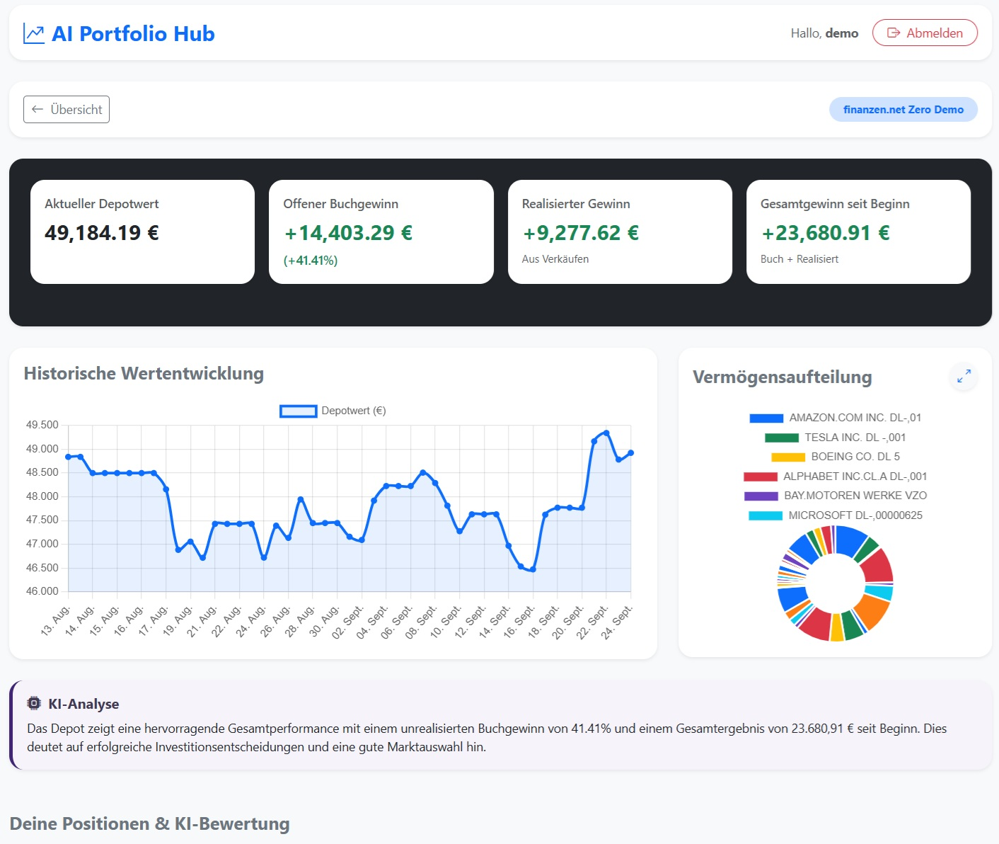
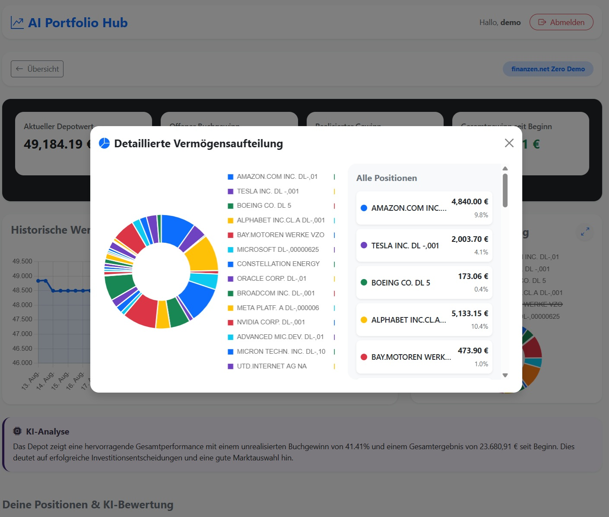
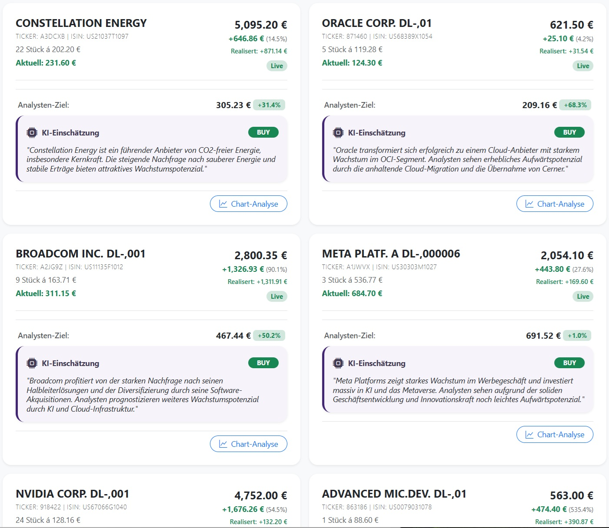
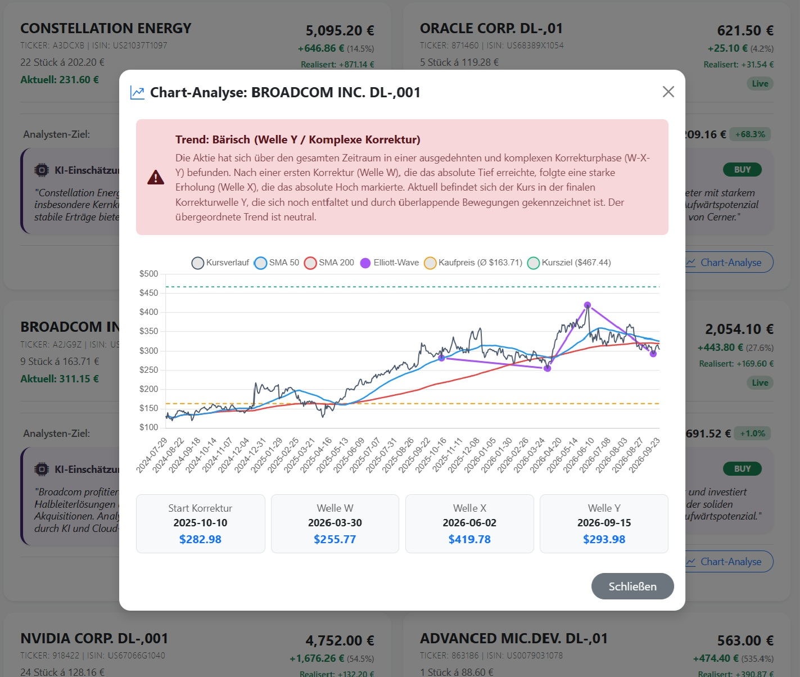
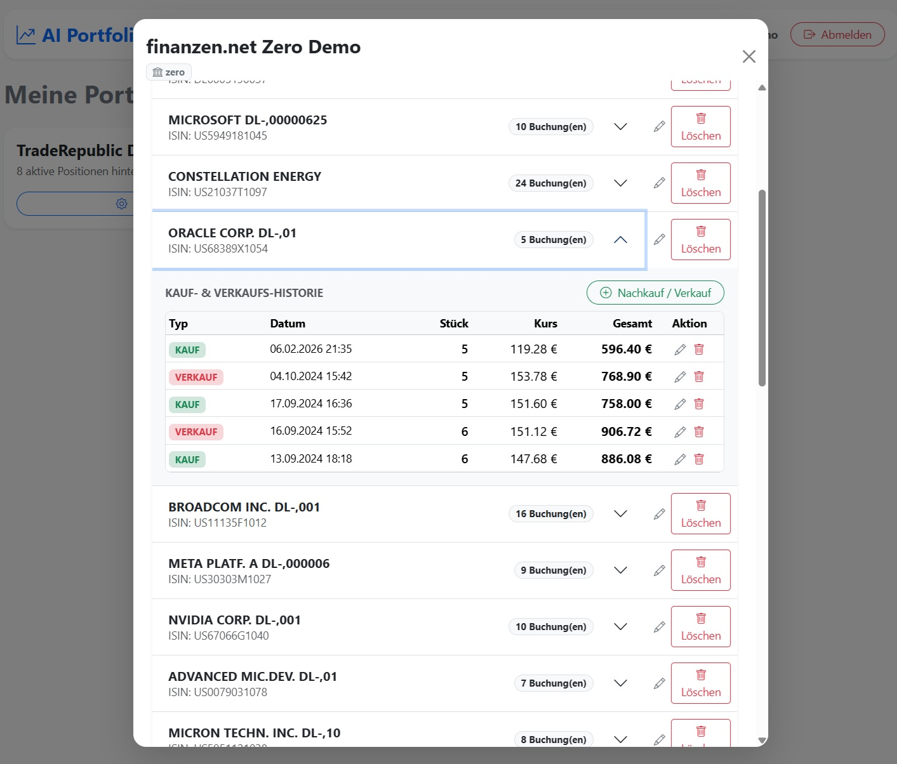
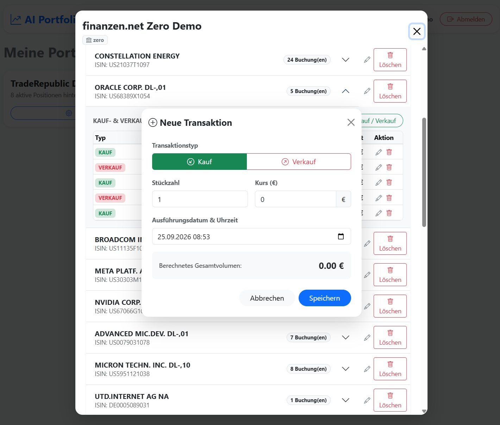

# 📊 Advanced Portfolio & Technical Analysis Platform (Elliott Wave & SMA)

> **Showcase Repository:** Dieses Repository dient als visuelles und architektonisches Portfolio für eine vollumfängliche Fullstack- & Cloud-Native-Anwendung zur automatisierten Portfolio-Analyse, technischen Chart-Analyse (SMA 50/200, Elliott-Wellen) und Echtzeit-Auswertung.

---

## 🌟 Über das Projekt

Die Plattform kombiniert klassisches Asset-Management mit fortgeschrittener technischer Chartanalyse und externen Finanz-APIs. Sie aggregiert Marktdaten, berechnet Rendite- und Risikokennzahlen und unterstützt den Anleger durch dynamische Chart-Overlays und automatisierte Kennzahlen-Ermittlung.

### Key Features
* 📈 **Interaktives Portfolio-Dashboard:** Echtzeit-Übersicht über Kaufpreise, aktuelle Kurse, Kursziele, Positionen und Gesamtrenditen.
* 🎯 **API-basierte Kursziele & Upside-Analyse:** Automatische Ermittlung von offiziellen Kurszielen (`targetPrice`) und prozentualen Potenzialen (`priceTargetUpsidePercent`) über eine dedizierte Finanz-API.
* 🌊 **Elliott-Wellen & Indikatoren-Chart:** Dynamisches Canvas-Chart-Overlay inklusive **SMA 50**, **SMA 200**, Kaufpreis-Linie und grüner Kursziel-Visualisierung.
* 🔒 **Enterprise Security & Zero-Trust Secrets:** Sichere Secrets-Verwaltung über Kubernetes Secrets und Umgebungsvariablen.
* 🐳 **Cloud-Native Deployment:** Vollständige Containerisierung und Orchestrierung auf einem lokalen Kubernetes-Cluster (Mini-PC) inklusive automatisierter DB-Backups.

---

## 🏗️ Systemarchitektur & Cloud Infrastructure

Das System ist als saubere 3-Tier-Architektur aufgebaut und wird auf einem lokalen Kubernetes-Cluster betrieben.

```text
+---------------------------------------------------------------------------------+
|                                USER INTERFACE                                   |
|                  Angular 18+ (TypeScript / RxJS / Canvas Charts)                |
+---------------------------------------------------------------------------------+
                                         |
                                         v  REST API
+---------------------------------------------------------------------------------+
|                            PORTFOLIO SERVICE (Backend)                          |
|                     Java & Spring Boot / Spring Data JPA / REST                 |
+---------------------------------------------------------------------------------+
                                   |                 |
                         JPA / TLS v                 v REST API
          +----------------------------------+     +------------------------------+
          |      PostgreSQL Database         |     |     EXTERNAL FINANCIAL API   |
          |    (Local Kubernetes Pod)        |     | (Market Data & Price Targets)|
          +----------------------------------+     +------------------------------+
                           |
                           v Persistence
          +----------------------------------+
          |  Local HostPath Volume Storage   |
          +----------------------------------+

-----------------------------------------------------------------------------------
|                           KUBERNETES INFRASTRUCTURE                             |
| Deployments | Services | Ingress | K8s Secrets | VolumeMounts | Health Checks   |
-----------------------------------------------------------------------------------

### Technologiestack im Detail

* **Frontend:** Angular, TypeScript, RxJS, HTML5 / SCSS (Custom Canvas Charting für SMA 50/200 & Elliott-Wellen)
* **Backend:** Java 17/21, Spring Boot, Spring Data JPA, Hibernate, RESTful Web Services, Maven
* **Datenbank:** PostgreSQL (ausgeführt als isolierter Kubernetes-Pod mit HostPath Volume Persistenz)
* **DevOps & Infrastructure:** Kubernetes (k8s Manifests, Secrets-Management via `secretKeyRef`), Docker (Multi-Stage Builds), Shell-Scripting (Automatisierte DB-Backups)
* **Architecture:** Clean Architecture, Decoupled Configuration Pattern

---

## 🖼️ Einblicke in die Anwendung (Screenshots)

*Hinweis: Die Screenshots dienen zur Veranschaulichung der Benutzeroberfläche und Architektur.*

  
*Abbildung 1: Haupt-Dashboard mit Portfolio-Übersicht, Asset-Verteilung und aggregierten Performancedaten*

  
*Abbildung 2: Detaillierte Asset-Allokation mit Donut-Chart-Visualisierung und prozentualer Verteilung*

  
*Abbildung 3: Übersichtliche Kachelansicht der einzelnen Portfolio-Positionen inklusive Kurs-Trends*

  
*Abbildung 4: Technisches Chart-Overlay (SMA 50, SMA 200, Kaufpreis, Elliott-Wellen-Muster & API-Kursziel)*

  
*Abbildung 5: Tabellarische Verwaltung aller Wertpapiere, Einstandskurse und Transaktionshistorien*

  
*Abbildung 6: Dialogfenster zur Erfassung und Validierung neuer Portfolio-Transaktionen*

---

## 🔒 Quellcode & Code-Review Policy

Aus Gründen des Urheberrechts und zum Schutz des geistigen Eigentums ist der Quellcode dieses Projekts **nicht öffentlich zugänglich (Closed Source)**.

> 💡 **Für Recruiter, Software Architekten & potenzielle Arbeitgeber:**  
> Ein tieferer Einblick in den Quellcode (Angular Components, Spring Boot Services, Kubernetes-Manifeste) kann auf Anfrage sehr gerne im Rahmen eines technischen Vorstellungsgesprächs oder einer Remote-Live-Demo gewährt werden.

💡 Für Recruiter, Software Architekten & potenzielle Arbeitgeber:

Ein tieferer Einblick in den Quellcode (Angular Components, Spring Boot Services, Kubernetes-Manifeste) kann auf Anfrage sehr gerne im Rahmen eines technischen Vorstellungsgesprächs oder einer Remote-Live-Demo gewährt werden.
